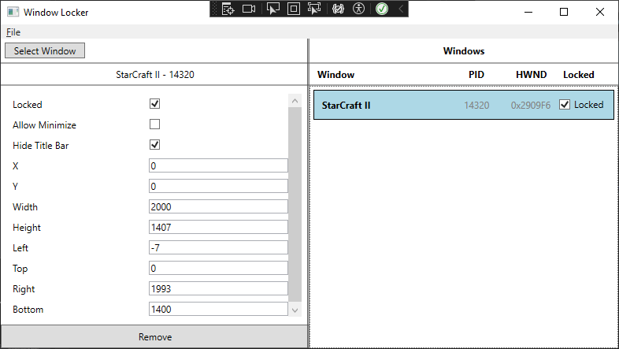

# WindowLocker

Simple application for anchoring windows to a specified position.

## Usage

Simply select the window you wish to anchor and check **Locked**.
When locked you can adjust the size and position of the window using the text box, or choose to hide the title bar and more.

### How to select a window

- Click and hold **Select Window** button, hover over the window you wish to anchor and release.
**or**
- **File->Select Process From List** and select the window from a list

### Presets
Once you have anchored your windows, you can save the layout as a JSON file for future sessions.

There are two methods to load a preset:

**Manual Selection: (Recommended)**

1. Open and select the windows you plan to use.
2. To manually select which preset is applied to each window, navigate to **File -> Open Preset**. A window will appear resembling the main window.
3. Each preset is loaded individually. Select a window from the right list and click "Apply." The preset will be applied, and the next preset will be loaded.

**Auto Selection:**

1. This method does not require pre-opening windows, though your application might.
2. Use **File -> Open Preset Auto**. The selected windows will be searched for a matching preset and applied.
3. If a window matching the preset is not found, the application will attempt to start a new process using the filename and arguments from the preset.
